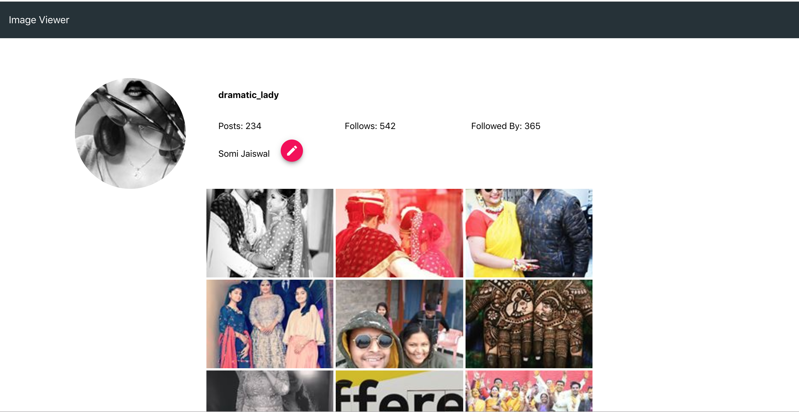
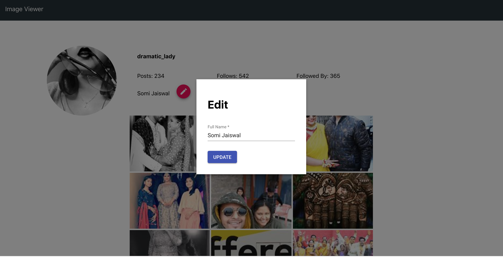

# ImageViewer

ImageViewer is a web application, which allows a user to view his/her own profile and the images posted by the user on his/her Instagram account.

This project was bootstrapped with [Create React App](https://github.com/facebook/create-react-app).

Below you will find some information on how to perform common tasks. 
You can find the most recent version of this guide [here](https://github.com/facebook/create-react-app/blob/master/packages/react-scripts/template/README.md).

## To tackel CORS issue we have used the Express server as a proxy which will run on port 8080

## Below is the snapshot of the Profile screen

* On page load - We hit two api 
  
    * First API brings user info
    * Second API brings the media info

### profile page

### On click of full name edit

### On click of grid image
